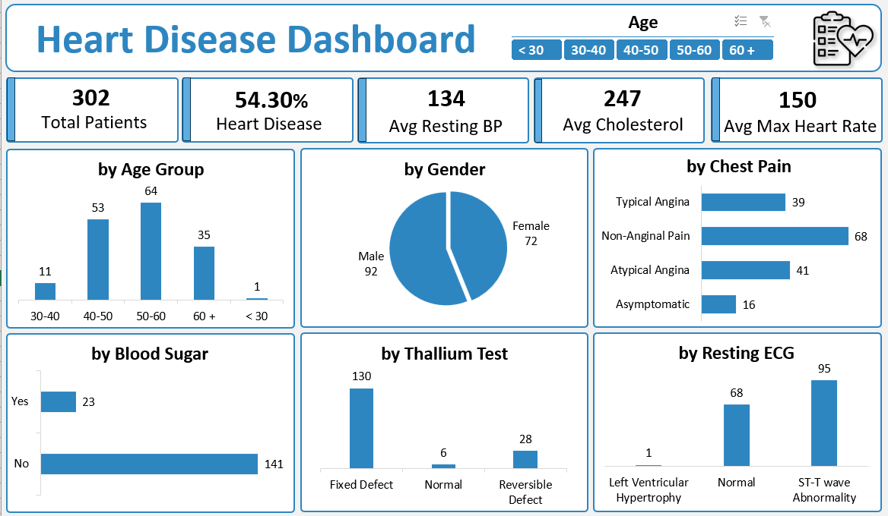
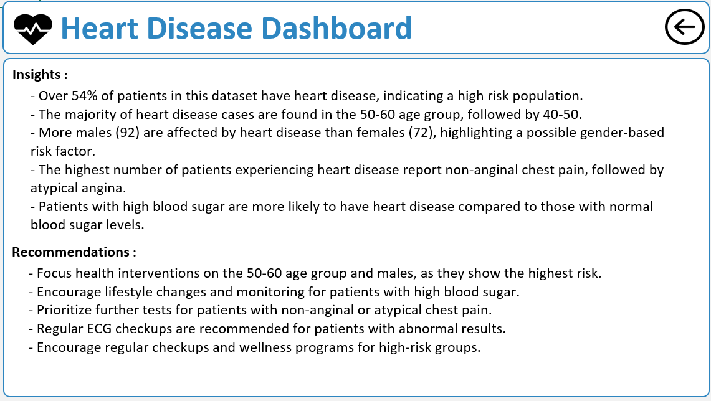

# Heart Disease Analysis

This project analyzes heart disease diagnostic data to uncover trends and provide actionable insights for healthcare professionals. The analysis focuses on key risk factors such as age, gender, cholesterol levels, blood pressure, and chest pain types, offering recommendations for early detection and prevention.

## Table of Contents
- [Introduction](#introduction)
- [Objective](#objective)
- [Dataset](#dataset)
- [ETL Process](#etl-process)
- [Methodology](#methodology)
- [Dashboard Overview](#dashboard-overview)
- [Key Insights](#key-insights)
- [Recommendations](#recommendations)
- [Future Work](#future-work)
- [Installation](#installation)
- [Usage](#usage)
- [Contributing](#contributing)
- [License](#license)

## Introduction
Heart disease is one of the leading causes of death worldwide. This project aims to use heart disease diagnostic data to help healthcare professionals identify trends and at-risk groups. The insights derived from the analysis can be used for early detection and effective preventive measures.

## Objective
The objective of this project is to:
- Identify key risk factors associated with heart disease.
- Analyze demographic and clinical metrics to highlight trends.
- Provide recommendations for preventive healthcare and treatment strategies based on the data.

## Dataset
The dataset consists of patient records with the following attributes:

- **Age**: Patient's age
- **Sex**: Gender of the patient
- **Chest Pain Type**: Categorized into 4 types
  - 0: Typical Angina
  - 1: Atypical Angina
  - 2: Non-anginal Pain
  - 3: Asymptomatic
- **Resting Blood Pressure**: Blood pressure in mmHg at rest
- **Serum Cholesterol**: Cholesterol level in mg/dl
- **Fasting Blood Sugar**: Indicator if fasting blood sugar > 120 mg/dl (1 = true, 0 = false)
- **Resting ECG Results**: Electrocardiographic results, with values:
  - 0: Normal
  - 1: Having ST-T wave abnormality (T wave inversions and/or ST elevation or depression of > 0.05 mV)
  - 2: Showing probable or definite left ventricular hypertrophy
- **Maximum Heart Rate Achieved**
- **Exercise Induced Angina**: (1 = Yes, 0 = No)
- **Oldpeak**: ST depression induced by exercise relative to rest
- **Slope of the Peak Exercise ST Segment**: 
  - 0: Upsloping
  - 1: Flat
  - 2: Downsloping
- **Number of Major Vessels**: (0-3) colored by fluoroscopy
- **Thalassemia (Thal)**:
  - 0: Normal
  - 1: Fixed defect
  - 2: Reversible defect

## ETL Process
1. **Extract**: Data was imported into Excel for analysis.
2. **Transform**: Cleaned and categorized data for analysis, handling missing values and ensuring consistency in data formatting.
3. **Load**: The cleaned dataset was loaded into an Excel dashboard for visualization.

## Methodology
The following steps were carried out to analyze the data:
1. **Data Collection**: Imported the heart disease dataset into Excel.
2. **Data Cleaning**: Removed duplicates, handled missing values, and categorized variables such as chest pain type, age group, and thalassemia.
3. **Exploratory Data Analysis (EDA)**: Analyzed relationships between different attributes (age, gender, cholesterol, blood pressure, etc.) and their impact on heart disease prevalence.
4. **Visualization**: Created an interactive Excel dashboard for insights visualization.

## Dashboard Overview
The Excel dashboard presents a comprehensive view of the following:
- **Age & Gender Distribution**: Analyzes how age and gender affect heart disease risk.
- **Cholesterol & Blood Pressure Trends**: Shows correlations between cholesterol levels, blood pressure, and heart disease.
- **Chest Pain Types**: Explores the relationship between various chest pain types and heart disease diagnosis.
- **ECG & Thallium Test Results**: Examines the impact of ECG abnormalities and thallium test results on heart disease diagnoses.

## Key Insights
- **Age Group**: The age group 50-60 shows the highest prevalence of heart disease.
- **Gender**: Males are more likely to develop heart disease than females.
- **Cholesterol & Blood Pressure**: High cholesterol and elevated resting blood pressure are significant risk factors for heart disease.
- **Chest Pain Types**: Non-anginal and atypical angina chest pain are strongly linked to heart disease diagnoses.
- **ECG & Thallium Test**: Patients with ECG abnormalities and fixed thallium defects are at higher risk of heart disease.

## Recommendations
- **Regular Health Screenings**: Encourage frequent screenings for individuals over 50, particularly men.
- **Promote a Healthy Lifestyle**: Stress the importance of a balanced diet, regular exercise, and stress management to control cholesterol and blood pressure.
- **Target High-Risk Groups**: Focus on patients with specific chest pain types and high cholesterol for early intervention.
- **Public Awareness Campaigns**: Increase awareness about the risk factors of heart disease, especially cholesterol, blood pressure, and chest pain symptoms.
- **Use Diagnostic Tools**: Leverage ECG and thallium test results for customized care plans for high-risk patients.

## Future Work
- **Expand the Dataset**: Incorporate more patient records to improve the generalizability of the findings.
- **Include More Variables**: Analyze other factors such as smoking status, physical activity, and diet to provide a more comprehensive view of heart disease risk.
- **Develop Predictive Models**: Build machine learning models to predict heart disease risk based on key attributes in the dataset.
- **Collaborate with Healthcare Experts**: Partner with cardiologists and public health professionals to validate the findings and implement actionable strategies in real-world settings.

## Installation
To explore the analysis and dashboard, the following software is required:
- [Microsoft Excel](https://www.microsoft.com/en-us/microsoft-365/excel)

## Usage
1. Open the `Heart Disease Analysis Dataset.xlsx` file in Excel.
2. Use the interactive dashboard to explore trends and insights.

## Contributing
Contributions are welcome! Please follow these steps to contribute:
1. Fork the repository.
2. Create a new branch (`git checkout -b feature-branch`).
3. Commit your changes (`git commit -m 'Add feature'`).
4. Push to the branch (`git push origin feature-branch`).
5. Create a Pull Request.

## License
This project is licensed under the MIT License - see the [LICENSE](LICENSE) file for details.

---

### Author:
[Vijay Sanas](https://github.com/VijaySanas3)
